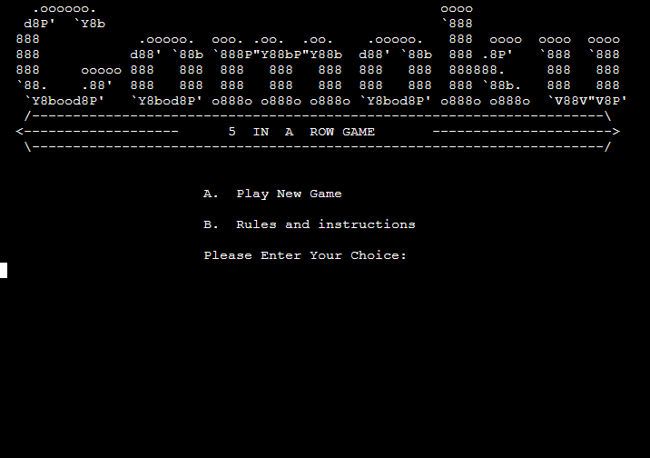
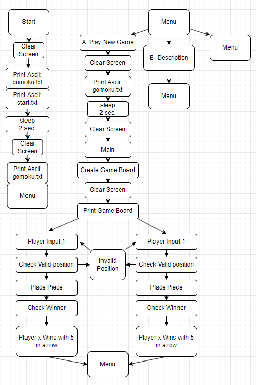
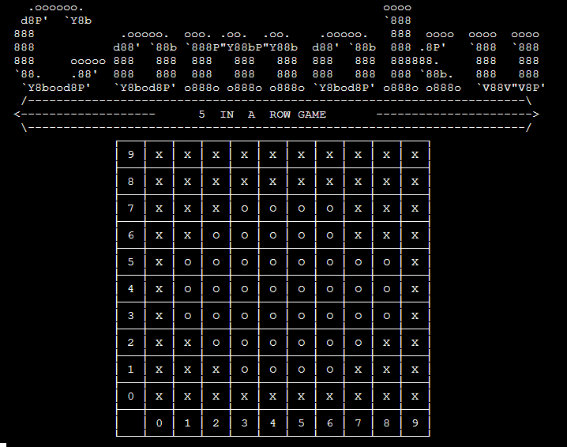
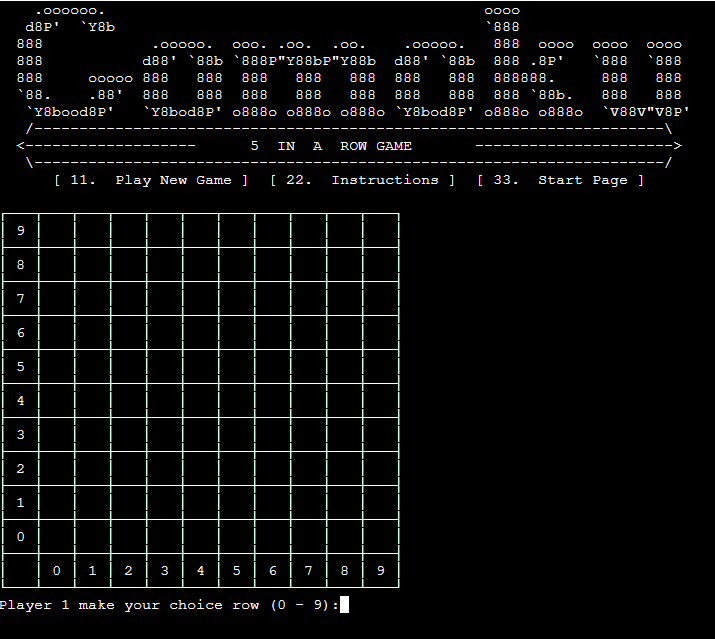
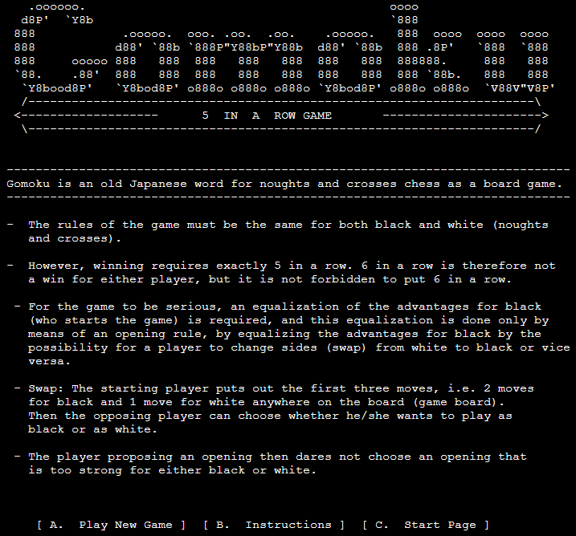
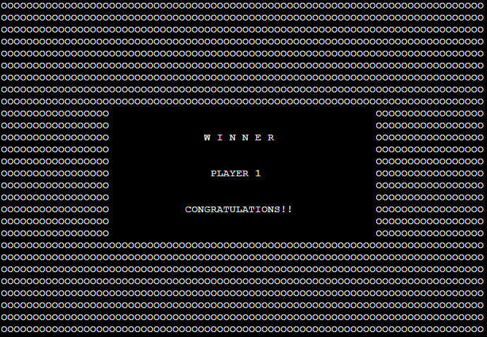

# Welcome to Gomocu

The deployed web app can be accessed [here](https://gomokunianswe-3b8eed28aaa7.herokuapp.com/).

## User Experience (UX)

*   ### Project Goals
    -   <b>Board Game:</b> The goal has been to create a game, easy to understand and a challenge for all ages, it is a game for two players to compete to get 5 pieces in a row, horizontally, vertically or diagonally.

*   ### Target Audience
    -   <b>People in all ages.</b>
 
*   ### Flow Charts

    -   The Flowchart was created using DrawIo free online app <b>[app.diagrams.net](https://app.diagrams.net/)</b> it follows the steps from start, menu and validation of input data.
    
    
         
 

*   ### Design
     
- <b>Welcome screen:</b> View at start in 2 seconds.  
      
- <b>Start menu screen:</b> Logo and menu with A . Play New Game and B. Rules and instructions. Input your choice.  
      
- <b>Game Board:</b> Logo and Game Board, Player starts and input row position and column position, Piece will be places on the board O for Player 1 and X for Player 2.  
      
- <b>Instructions:</b> Rules and instructions of the game.  
       
- <b>Winner Banner:</b> Information about winning player.  
           

## Features
*   ### Existing Features
    -   <b>Menu:</b> User input to choose Play New Game or Instructions
    -   <b>Ïnstructions:</b> Game instructions
    -   <b>Game board:</b> Grid 10 x 10 with header on left and at bottom marcin rows and columns 0 - 9.
    -   <b>Place a Piece:</b> Place the players mark O or X on the game board at choosen position.
    -   <b>Check if position/column/row is available:</b> Check if position is available on the game board, or replay with information if position already is taken.
    -   <b>Check for winner:</b> 
        - Horizontal check for 5 pices in a row for a player.
        - Vertical check for 5 pices in a row for a player.
        - Diagonal in check in both directions for 5 pices in a row for a player.
    -   <b>Winner Banner:</b> Full Screen Banner with information of winning Player.

*   ### Future Features 
    -   <b>Board with bigger grid with more rows and columns.</b>
    -   <b>User registration.</b>
    -   <b>High score board with results.</b>

*   ### Remaining Bugs 
    -   <b>No known bugs</b> 

## Project Structure

*   ### Main Scope
    -   <b>run.py:</b> This is the main entry point of the application. 
    -   <b>assets\images:</b>: text files with instructions and ascii art.
    -   <b>media:</b>: Pictures for README.md.

## Libraries 
- <b>Numpy:</b> Used to make it easier to create game board grid, and to append header column and row with information of column and row number to make the user experiance better.
- <b>Tabular:</b> Used to print game board grid.
- <b>Time:</b> Used to sleep to pause printed images before clear and print new image.
- <b>OS:</b> Used for clear / cls to clear terminal screen.

## Validator Testing
- PEP8:
    - No errors were returned from https://pep8ci.herokuapp.com/
    - Manual testing all menu choice.
    - Manual testing multiple random 5 in a row combinations horizontal, verical and diagonal.
    
## Deployment
This project is deployed using Code Institute's mock terminal for Heroku.
Terminal size is changed from original 80 columns x 24 rows  to 80 columns x 40 rows for gameboard and instruction page to fit.

Steps for Deployment:
1. Fork or Clone [GitHub Repository](https://github.com/nianswe/ci_project3.git)
2. Create a new Heroku app
3. Set the build packs to Python and node.js (in that order)
4. Add Config Variables 'PORT'
5. Link the Heroku app to the repository
6. Click Deploy

## Credits
- How to print a grid: https://pypi.org/project/tabulate/

- Insperation how to print a game board grid and check if player has 5 i a row:
        https://www.youtube.com/@KeithGalli
        https://www.youtube.com/watch?v=UYgyRArKDEs

- How to add row and column for header to nampy array
        https://stackoverflow.com/questions/11106536/adding-row-column-headers-to-numpy-arrays

- How to print textfile and ascii art to terminal: https://learnlearn.uk/python/ascii-art/

- How to create a menu with choices to trig functions: https://stackoverflow.com/questions/49226804/python-input-menu-function
